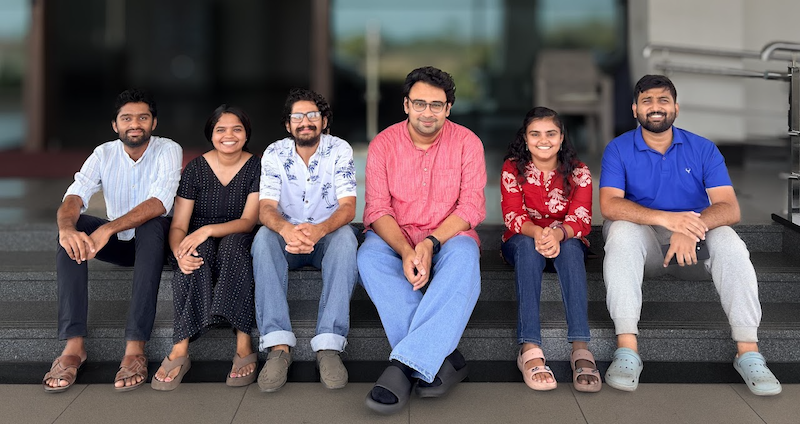

 April 2026

Current Members
------
- **Harikrishnan K J:** PhD student (PMRF)
- **Chandrima B Pushpan:** PhD student (MSc-PhD Dual Degree, HTRA)
- **Vimal Sreekanth:** PhD student (Regular, HTRA)
- **Vishnupriya K:** Project JRF

Former Members
------
- Jithin G. Krishnan (PhD, January 2021 - April 2026)
- Fathimathu Thasni K K (Masters student, 2024-2026)
- Vishnupriya K (Masters student, 2023-2025, Now Project JRF at IIT Palakkad)
- Vimal Sreekanth (Masters student, 2023-2025, Now Project JRF at IIT Palakkad) 2023-2025 (Now pursuing PhD at IIT Palakkad)
- Aman Tiwari, 2022-2024 (Now pursuing PhD at IIT Roorkee)
- Amir Hamza (Joint Project)  2021-2023 (Now pursuing PhD at IIT Bombay)
- Nikhil Mesquita, 2021-2023 (Now pursuing PhD at RRI Bangalore
- Chandrima B. Pushpan, 2020-2022 (Now pursuing PhD at IIT Palakkad)
- Yash Chugh (Joint Project) 2019-2021
- Pram Milan (Joint Project) 2019-2021 (Now pursuing PhD at IIT Hyderabad)
- Hridya R, 2019-2021 (Now pursuing PhD at TIFR, Mumbai)

Joining the Group
------

**PhD:** We are always looking for motivated and skilled candidates from diverse backgrounds to join our group as PhD students. To pursue your PhD with us, you have to hold a MSc/MS degree in Physics, and pass one of the competitive national-level examinations (see IIT Palakkad Research Portal for details). Eligible candidates will have to go through the admission procedure in place, typically including an examination and an interview. If you are interested, please get in touch via email, attaching your CV, prior to applying formally for more information on research topics and availability of positions. 

**Postdoc:** We have a few very competitive post-doc positions at the Department, and we encourage interested postdoctoral candidates to apply for their own funding with us. If you are interested,  please contact by sending an email with your CV. Possible funding information can be found below. 

- ANRF-National Post-Doctoral Fellowship
- Woman Scientist position

**MSc Projects:** Motivated Students from the MSc Physics program of IIT Palakkad can pursue their third (minor) and fourth (major) semester projects in the group. If you are interested, please contact by sending an email to know more about the available projects. 
